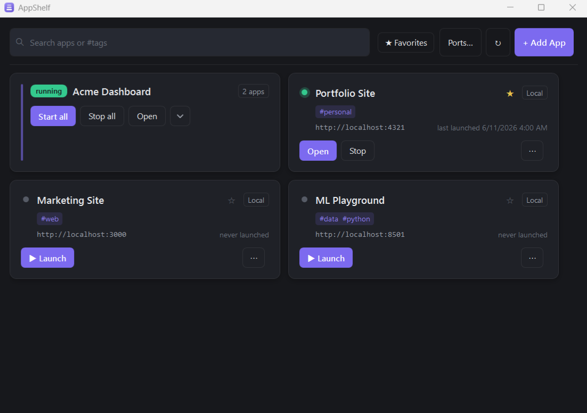
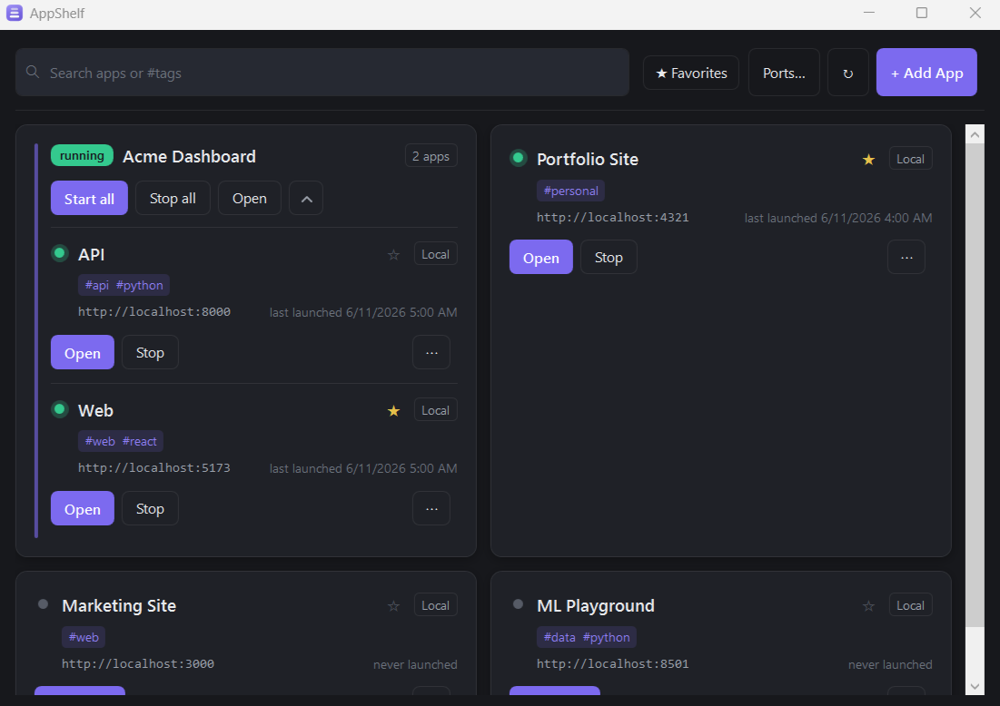
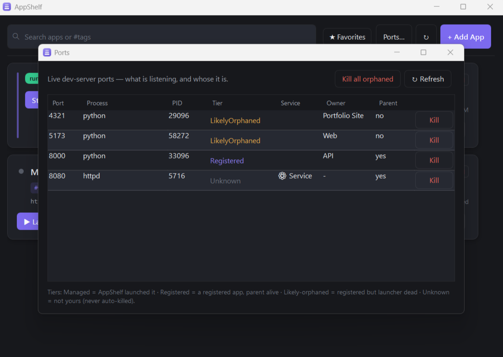

<p align="center">
  
</p>

<h1 align="center">AppShelf</h1>

**Stop typing `npm run dev` every morning.** AppShelf is a personal, one-click launcher for
your local web/prototype projects on Windows — register a project once, then start its dev
server and open the browser with a single click (or one CLI command). Think *Spotlight for your
own local apps*.

> Personal cockpit, not a product: single-user, Windows-first, optimized for convenience.

<p align="center">
  
</p>

---

## Why

Every local project means opening a terminal, `cd`-ing in, remembering whether it's `npm run dev`
or `streamlit run` or `uvicorn`, waiting for the port, then opening the browser. AppShelf does all
of that from one window — and, crucially, **stops cleanly**: it kills the whole process tree
(via a Win32 Job Object) so there are no orphaned `node` processes squatting on port 5173.

## Features

- **Card grid** with live status (running / starting / stopped / error), status glow, search, and
  a one-click favorite star.
- **One-click launch** — starts the dev server, polls until the port is actually up (IPv4 **and**
  IPv6), then opens the browser.
- **Clean stop** — tears down the entire process tree and frees the port. No orphans.
- **Project groups** — register a backend + frontend as a single collapsible card; Start-all brings
  the backend up before the frontend. Create groups by dragging cards together.
- **Port registry** — assign clash-free reserved ports across your projects (`appshelf ports`).
- **Port Doctor** — scan live dev ports, classify each by ownership (managed / registered /
  likely-orphaned / unknown), and kill zombie servers holding a port. Never auto-kills unknown
  processes.
- **System tray** — runs in the background; double-click to reopen.
- **CLI** — `appshelf add | list | launch | stop | rm | port | ports | doctor | open`.
- **Stack auto-detection** for the common cases: Vite, Next.js, CRA, Astro, SvelteKit, Angular
  (via `package.json`), and FastAPI, Flask, Streamlit, Gradio (via file content). You always
  confirm/edit — it never guesses silently.
- **Hand-editable JSON config** at `%APPDATA%/AppShelf/config.json`. No database, no migrations,
  git-versionable.

## Screenshots

<p align="center">
  
</p>
<p align="center"><i>Group a backend + frontend into one card — expand to control each service individually.</i></p>

<p align="center">
  
</p>
<p align="center"><i>Port Doctor: see what's on every dev port, classified by ownership — and kill the zombies.</i></p>

## Requirements

- **Windows 10 or 11** (x64). AppShelf is Windows-only by design (WPF + Win32 Job Objects).
- **.NET 8 SDK** to build from source, or the **.NET 8 Desktop Runtime** to run a framework-dependent
  build. (Pre-built releases are self-contained — no runtime needed.)

## Install

### Option A — download a release (recommended)

1. Grab the latest `AppShelf.exe` from the [Releases](../../releases) page.
2. Run it. It lives in your system tray; click **+ Add App** to register your first project.

### Option B — build from source

```powershell
git clone <your-fork-url> AppShelf
cd AppShelf
dotnet build AppShelf.sln
dotnet run --project src/AppShelf.App
```

### CLI on your PATH

```powershell
dotnet publish src/AppShelf.Cli -c Release -r win-x64 -p:PublishSingleFile=true
# add the output folder (bin/Release/net8.0-windows/win-x64/publish) to your PATH
```

Then from inside any project folder:

```powershell
appshelf add          # detect the stack, confirm, and register it
appshelf list         # name | type | status | port | url
appshelf launch <name>
appshelf stop <name>
```

## Quick start

1. `cd` into a project (e.g. a Vite app).
2. Run `appshelf add` — it detects `npm run dev` and port `5173`; confirm.
3. Open AppShelf (tray icon, or `appshelf open`).
4. Click **Launch** on the card. The server starts, the port comes up, the browser opens.
5. Click **Stop** when you're done — the whole process tree dies and the port is freed.

## Configuration

Everything lives in a single hand-editable file:

```
%APPDATA%/AppShelf/config.json
```

It's plain, indented JSON (camelCase). You can edit it directly, but prefer the CLI/GUI so writes
stay atomic. **Treat this file as trusted** — see [SECURITY.md](SECURITY.md).

## Claude Code integration (optional)

The [`skill/`](skill/) folder contains two [Claude Code](https://claude.com/claude-code) skills that
wrap the CLI, so you can say things like *"add this project to AppShelf"* or *"what port is my-app
on?"* from any terminal. They're thin wrappers over `appshelf` — drop them into your Claude skills
directory to use them. Ignore the folder entirely if you don't use Claude Code.

## Known limitations

- **Spotlight overlay** (global-hotkey search launcher) is **not built yet** — it's the planned
  daily-driver feature.
- The dark theme doesn't yet restyle dropdowns (they keep stock Windows chrome).
- Killing a port held by a Windows **service** can fail with "Access is denied" (you'd need an
  elevated terminal); AppShelf surfaces the reason rather than silently failing.

## Architecture

- **`AppShelf.Core`** — the real engine (models, config, stack detection, process/job control,
  launch). A pure library: no UI, no `Console`. This is the single source of truth for all logic.
- **`AppShelf.Cli`** (`appshelf`) and **`AppShelf.App`** (WPF tray + grid) are thin front doors —
  they parse args / bind UI and call into Core. No business logic lives in them.
- Config is JSON via `System.Text.Json`; process trees are killed via Win32 Job Objects
  (`KILL_ON_JOB_CLOSE`); liveness is a dual-stack TCP connect check.

137 xUnit tests cover Core.

## License

[MIT](LICENSE).
